```{=openxml}
<w:p><w:pPr><w:jc w:val="center"/><w:spacing w:before="2200" w:after="200"/></w:pPr><w:r><w:rPr><w:i/><w:color w:val="888888"/><w:sz w:val="20"/></w:rPr><w:t>[ Sirah Digital logo — replace this line with public/sirah-digital-logo.png ]</w:t></w:r></w:p>
<w:p><w:pPr><w:jc w:val="center"/><w:spacing w:before="1000" w:after="120"/></w:pPr><w:r><w:rPr><w:b/><w:color w:val="1F3864"/><w:sz w:val="64"/></w:rPr><w:t>Accountant Module User Guide</w:t></w:r></w:p>
<w:p><w:pPr><w:jc w:val="center"/><w:spacing w:after="700"/></w:pPr><w:r><w:rPr><w:color w:val="555555"/><w:sz w:val="32"/></w:rPr><w:t>A complete guide for monthly accounting workflows</w:t></w:r></w:p>
<w:p><w:pPr><w:jc w:val="center"/><w:spacing w:before="900" w:after="0"/></w:pPr><w:r><w:rPr><w:caps/><w:color w:val="888888"/><w:sz w:val="18"/></w:rPr><w:t>Prepared for</w:t></w:r></w:p>
<w:p><w:pPr><w:jc w:val="center"/><w:spacing w:after="260"/></w:pPr><w:r><w:rPr><w:b/><w:sz w:val="30"/></w:rPr><w:t>Installtec</w:t></w:r></w:p>
<w:p><w:pPr><w:jc w:val="center"/><w:spacing w:after="0"/></w:pPr><w:r><w:rPr><w:caps/><w:color w:val="888888"/><w:sz w:val="18"/></w:rPr><w:t>Prepared by</w:t></w:r></w:p>
<w:p><w:pPr><w:jc w:val="center"/><w:spacing w:after="520"/></w:pPr><w:r><w:rPr><w:b/><w:sz w:val="30"/></w:rPr><w:t>Sirah Digital</w:t></w:r></w:p>
<w:p><w:pPr><w:jc w:val="center"/><w:spacing w:after="0"/></w:pPr><w:r><w:rPr><w:sz w:val="22"/></w:rPr><w:t>Version 1.0     |     13 June 2026</w:t></w:r></w:p>
<w:p><w:pPr><w:jc w:val="center"/><w:spacing w:before="2400"/></w:pPr><w:r><w:rPr><w:i/><w:color w:val="888888"/><w:sz w:val="18"/></w:rPr><w:t>Confidential and Proprietary. This document is prepared by Sirah Digital for the exclusive use of Installtec. It may not be reproduced or distributed in whole or in part without written permission.</w:t></w:r></w:p>
<w:p><w:r><w:br w:type="page"/></w:r></w:p>
<w:p><w:pPr><w:spacing w:after="240"/></w:pPr><w:r><w:rPr><w:b/><w:color w:val="1F3864"/><w:sz w:val="40"/></w:rPr><w:t>Table of Contents</w:t></w:r></w:p>
<w:p><w:r><w:fldChar w:fldCharType="begin" w:dirty="true"/></w:r><w:r><w:instrText xml:space="preserve"> TOC \o "1-2" \h \z \u </w:instrText></w:r><w:r><w:fldChar w:fldCharType="separate"/></w:r><w:r><w:rPr><w:i/><w:color w:val="888888"/></w:rPr><w:t>To build this table with section names and page numbers, right-click anywhere in this box and choose "Update Field" (or press F9). In most versions of Microsoft Word it updates automatically when the document is first opened.</w:t></w:r><w:r><w:fldChar w:fldCharType="end"/></w:r></w:p>
<w:p><w:r><w:br w:type="page"/></w:r></w:p>
```

# 1. Introduction

## 1.1 About This Guide

The Accountant Module is part of the Installtec management system developed by Sirah Digital. This guide explains how to use the module to manage the complete monthly financial cycle, including invoicing, vendor payments, payroll, expenses, and reporting.

The guide walks through every tab of the module in the order you are likely to use it during a typical month. Each section combines a short explanation with a screenshot of the actual screen, so you can follow along directly in the system.

## 1.2 Intended Audience

This guide is written for everyone who works with the financial side of Installtec:

- **Accountant** — the primary user, with full access to every feature in the module.
- **Operations Manager** — handles approval workflows and reviews reports.
- **Managing Director** — provides financial oversight and approves high-value items.
- **Founder** — receives executive reporting and approves top-tier amounts.

You do not need an accounting background to follow this guide, but a basic familiarity with invoices, bills, and payroll will help.

## 1.3 Document Conventions

A few simple conventions are used throughout this guide:

- **Bold text** indicates a user interface element, such as a button, field, or tab name.
- *Italic text* indicates emphasis.
- Screenshots illustrate each major workflow.
- Notes appear in a shaded box and provide additional context or warnings.

> **Note:** Screenshots in this guide show sample data. Your figures and records will differ.

# 2. Getting Started

## 2.1 Accessing the System

Open the application URL in any modern web browser — **Chrome**, **Edge**, **Firefox**, or **Safari**. The system is accessible from desktop computers, tablets, and mobile phones. No software needs to be installed.

## 2.2 Logging In

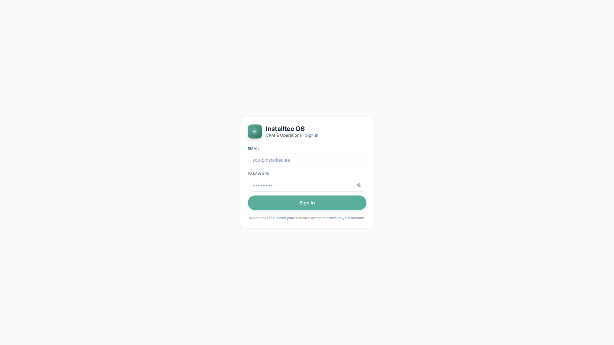

Enter your registered email and password, then click **Sign in** to access the system. If you have forgotten your password, your system administrator can reset it for you.

## 2.3 The Accountant Dashboard


After you sign in successfully, the system opens to the **Monthly View** dashboard. The Accountant Module is organized into twelve tabs, each covering a different part of financial operations. You can move between tabs at any time without losing your place.

## 2.4 Mobile Access for Field Use

The system is fully responsive and works on mobile devices. Key mobile-friendly features include:

- Receipt capture using the mobile camera for expense entry.
- View-only access to dashboards and reports while you are away from the office.
- Document upload directly from a mobile device.

This is particularly useful when you need to capture an expense receipt on site, or review the financial status of the business while travelling.

# 3. System Configuration

## 3.1 Initial Settings

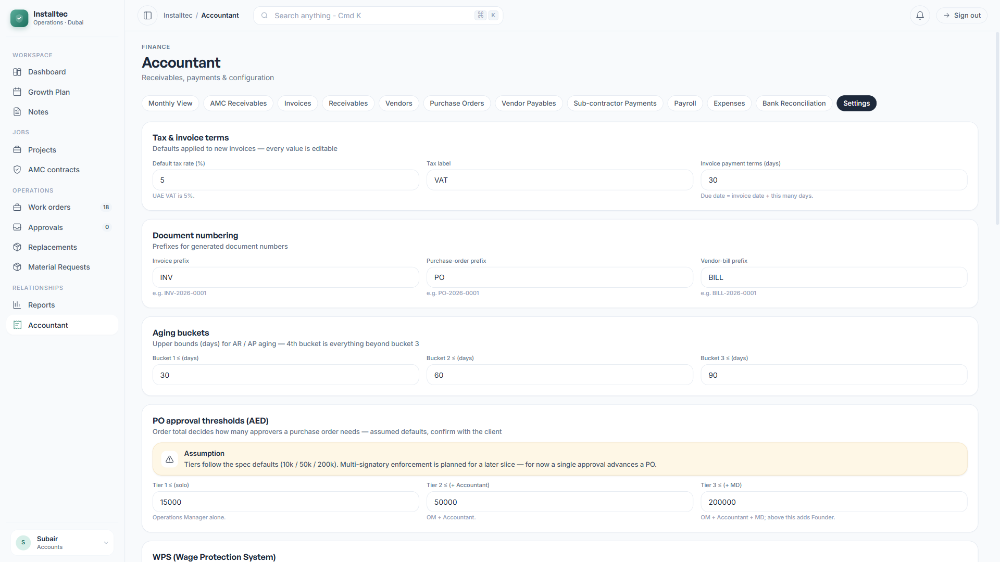

Before you begin regular use, configure the essential settings under the **Settings** tab. These settings control how documents are numbered, how VAT is calculated, who approves what, and how payroll files are generated.

## 3.2 Company Information

Set up the company details that appear on every financial document:

- Company name
- Tax Registration Number (TRN) — the 15-digit UAE TRN
- Address, phone, and email
- Banking details, used for receivable (payment) instructions

## 3.3 VAT Configuration

The system supports UAE VAT compliance:

- Default rate of **5 percent** (configurable).
- A VAT-inclusive or VAT-exclusive flag on each line.
- VAT-exempt category handling.
- Automatic VAT calculation on invoices and bills.

## 3.4 Document Numbering

The system automatically generates sequential document numbers, so you never have to assign them by hand:

| Document Type  | Format        | Example       |
|----------------|---------------|---------------|
| Invoice        | INV-YYYY-NNNN | INV-2026-0001 |
| Credit Note    | CN-YYYY-NNNN  | CN-2026-0001  |
| Purchase Order | PO-YYYY-NNNN  | PO-2026-0001  |
| Vendor Bill    | BILL-YYYY-NNNN| BILL-2026-0001|
| Vendor Code    | VEN-NNNN      | VEN-0001      |
| Employee Code  | EMP-NNNN      | EMP-0001      |
| Expense Number | EXP-YYYY-NNNN | EXP-2026-0001 |
| Payroll Run    | PR-YYYY-MM    | PR-2026-02    |

## 3.5 Approval Thresholds

Purchase Order approvals cascade according to the total value of the order:

- **Below AED 10,000** — Operations Manager.
- **AED 10,000 to 50,000** — Operations Manager and Accountant.
- **AED 50,000 to 200,000** — the above, plus the Managing Director.
- **Above AED 200,000** — the above, plus the Founder.

Expense approvals use a single threshold (default **AED 5,000**):

- **Below the threshold** — automatically approved.
- **Above the threshold** — Manager approval required.

All thresholds are configurable in the **Settings** tab without requiring any code changes.

## 3.6 WPS Configuration

For UAE Wage Protection System (WPS) compliance, configure the following:

- **MOL Establishment ID** — from your Ministry of Labour registration.
- **Employer Agent ID** — from your bank.
- **Bank Name**

These values appear in every WPS file the system generates for payroll submission.

## 3.7 Expense Categories

The system comes with eleven standard expense categories, which you can customize:

> Office Rent, Electricity, Water, Transportation, Fuel, Internet, Maintenance, Office Supplies, Communication, Travel, and Miscellaneous.

Categories can be added or modified at any time in **Settings**.

# 4. Monthly View Dashboard

## 4.1 Dashboard Overview

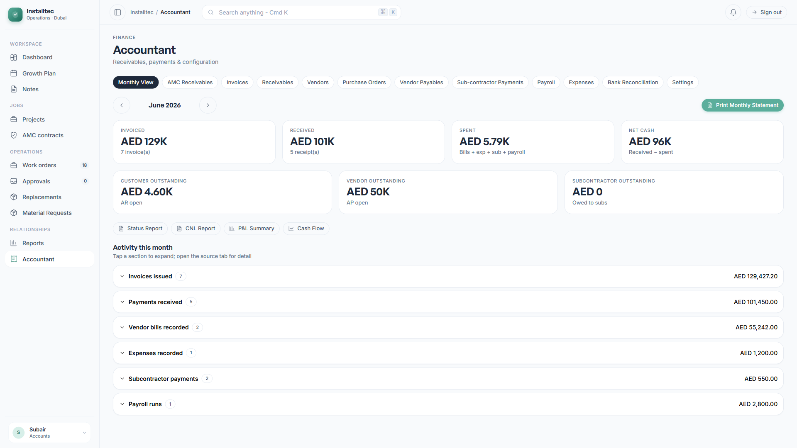

The **Monthly View** is the daily starting point for the Accountant. It brings financial activity from across all modules together onto a single screen, so you can see the state of the business at a glance.

## 4.2 Key Performance Indicators

Four KPI cards summarize the selected month:

- **Total Invoiced** — the sum of invoices issued.
- **Total Received** — customer payments collected.
- **Total Spent** — all outgoing payments combined.
- **Net Cash Position** — calculated as Received minus Spent.

Use the **Previous** and **Next** buttons to move between months. All figures update automatically.

## 4.3 Outstanding Balances

The **Outstanding** section shows current balances that need attention:

- **Customer Outstanding** (Accounts Receivable)
- **Vendor Outstanding** (Accounts Payable)
- **Subcontractor Outstanding**

## 4.4 Activity Sections

Collapsible sections list this month's transactions:

- Invoices Issued
- Payments Received
- Vendor Bills Recorded
- Expenses Recorded
- Subcontractor Payments
- Payroll Runs

Click any record to navigate to its detailed view.

## 4.5 Monthly Statement

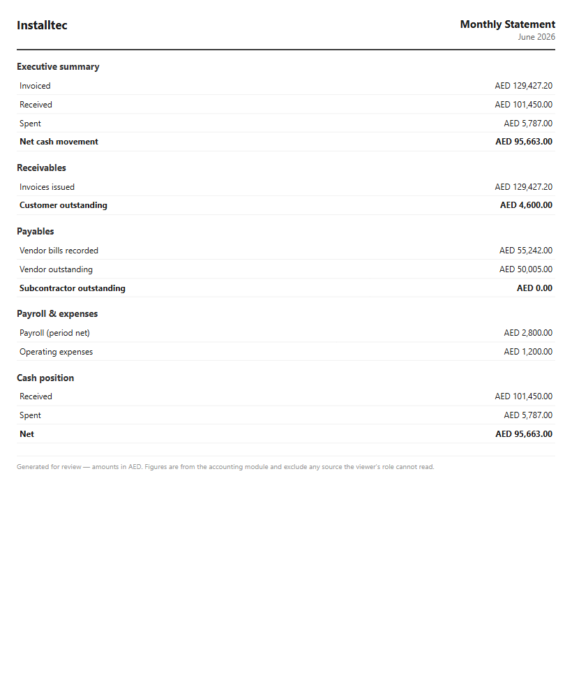

The **Print Monthly Statement** button generates an A4-formatted summary suitable for distribution to management. Use your browser's print function to save it as a PDF or to print it directly.

## 4.6 Status Report

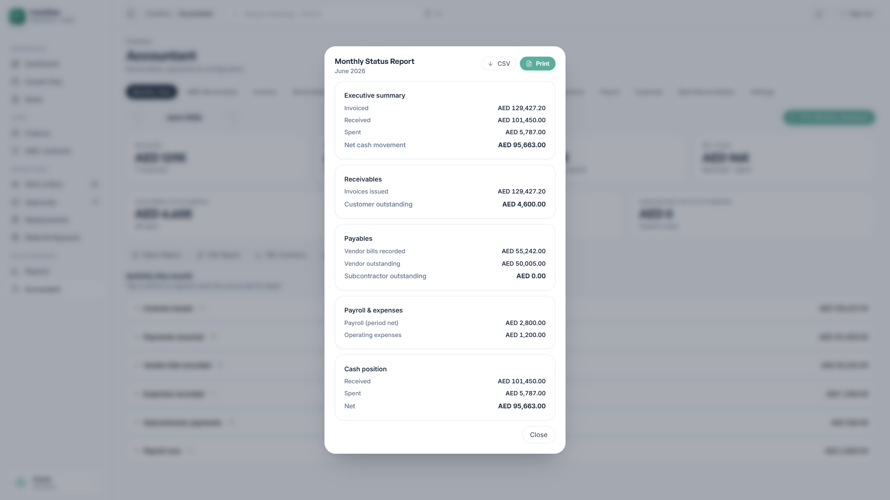

A formal monthly report that combines the receivables summary, payables summary, payroll summary, expense breakdown, and outstanding action items into one document.

## 4.7 CNL Report

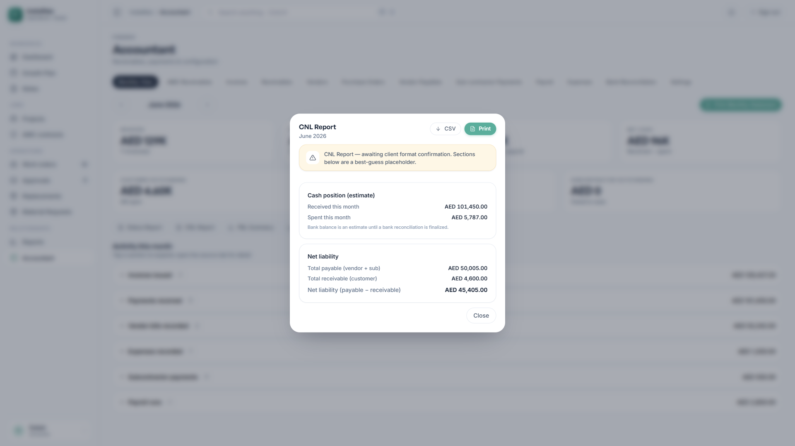

The CNL (Cash and Net Liability) report provides:

- A current cash position estimate.
- A net liability summary.
- The top outstanding customers and vendors.
- Month-on-month liability changes.

> **Note:** The CNL report format is being finalized in consultation with Installtec. The current implementation serves as a working template and may change.

## 4.8 Profit and Loss Summary

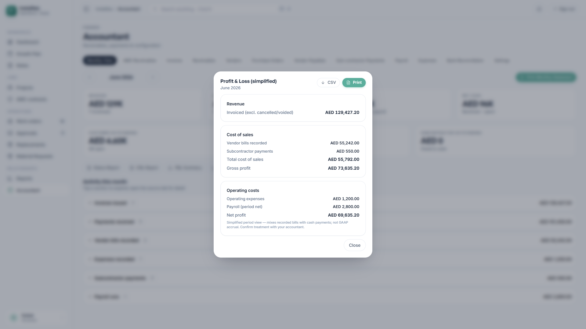

A period-based Profit and Loss statement showing revenue, cost of sales, operating expenses, payroll cost, gross profit, and net profit.

## 4.9 Cash Flow Summary

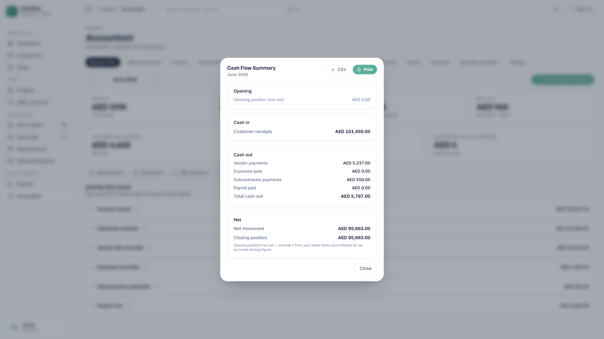

A monthly view of cash movement, tracking from the opening position through cash inflows and outflows to the closing position.

# 5. Customer Invoicing

## 5.1 Invoices Overview

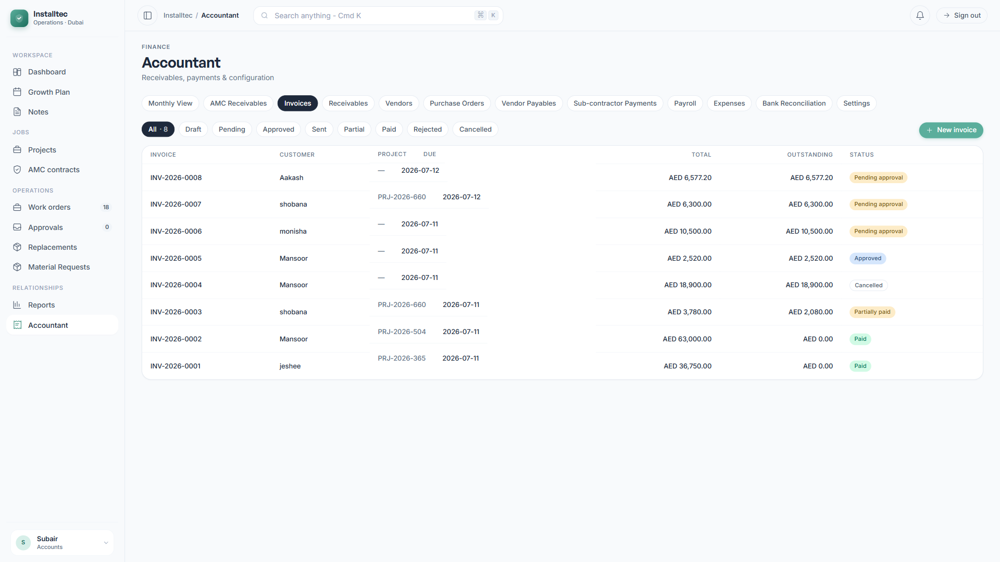

The **Invoices** tab manages the complete invoice lifecycle, from draft to payment. You can filter invoices by status, customer, project, or date range.

## 5.2 Invoice Statuses

- **Draft** — newly created and editable.
- **Pending Approval** — submitted for approval.
- **Approved** — approved and ready to send.
- **Sent** — delivered to the customer.
- **Partially Paid** — a partial payment has been received.
- **Paid** — fully settled.
- **Overdue** — past the due date with a balance remaining.
- **Cancelled** — voided.

## 5.3 Creating an Invoice

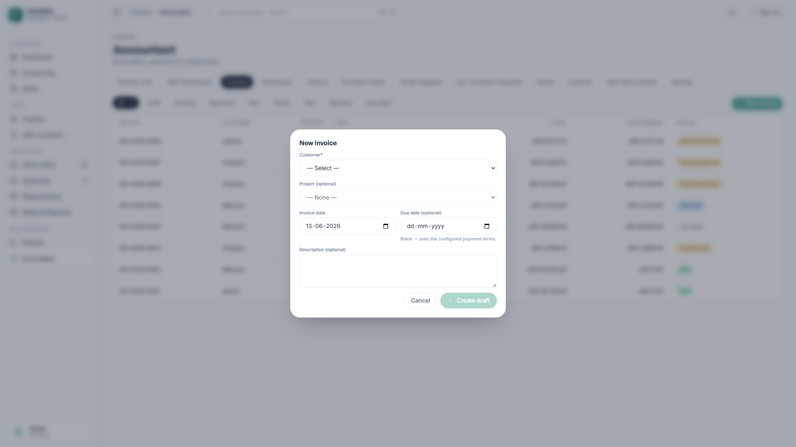

Click **New Invoice** to open the creation form. You will need to provide:

- Project selection (this auto-populates the customer).
- Invoice date and due date.
- Line items, each with a description, quantity, and unit price.
- The VAT rate for each line item.
- Payment terms and notes.

The system automatically calculates the subtotal, VAT amount, and total.

## 5.4 Invoice Workflow

1. The **Accountant** creates the invoice in **Draft** status.
2. The **Accountant** submits the invoice for approval.
3. The **Manager** reviews and approves the invoice.
4. The **Accountant** marks the invoice as sent to the customer.
5. The **Accountant** records payments as they are received.
6. The invoice status updates automatically to **Paid** when the full amount has been received.

## 5.5 Recording Payments

When a customer payment is received:

- Open the invoice.
- Click **Record Payment**.
- Enter the payment date, amount, method, and reference.

Partial payments are supported, and the status updates automatically.

## 5.6 UAE Tax Compliance

Every invoice automatically includes:

- The customer's TRN (Tax Registration Number).
- The company TRN.
- A per-line VAT breakdown.
- The total VAT amount.

These elements are required by the UAE Federal Tax Authority for all tax invoices.

# 6. Vendor Management

## 6.1 Vendors Overview

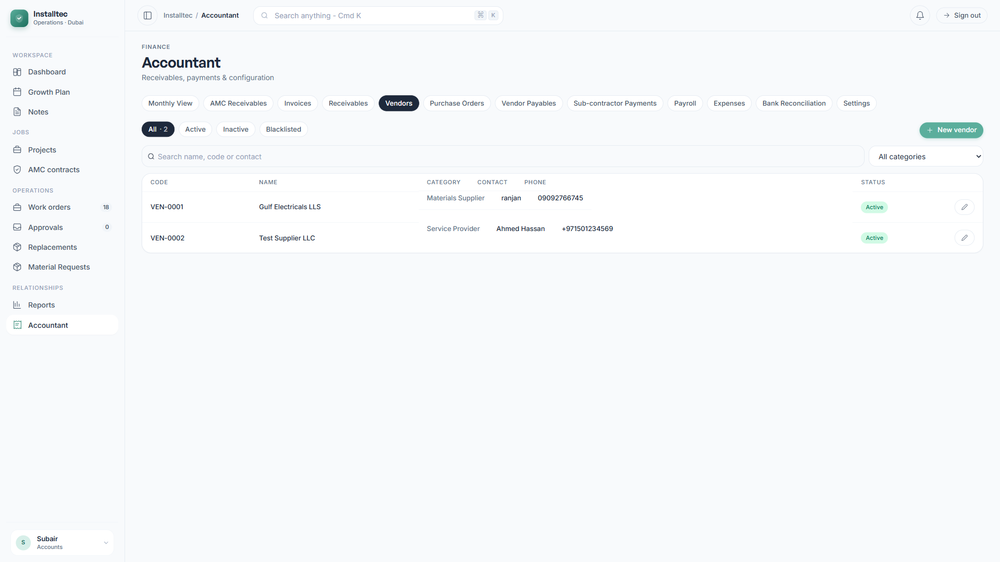

The **Vendors** tab manages all vendor records, including suppliers, service providers, and subcontractors.

## 6.2 Adding a Vendor

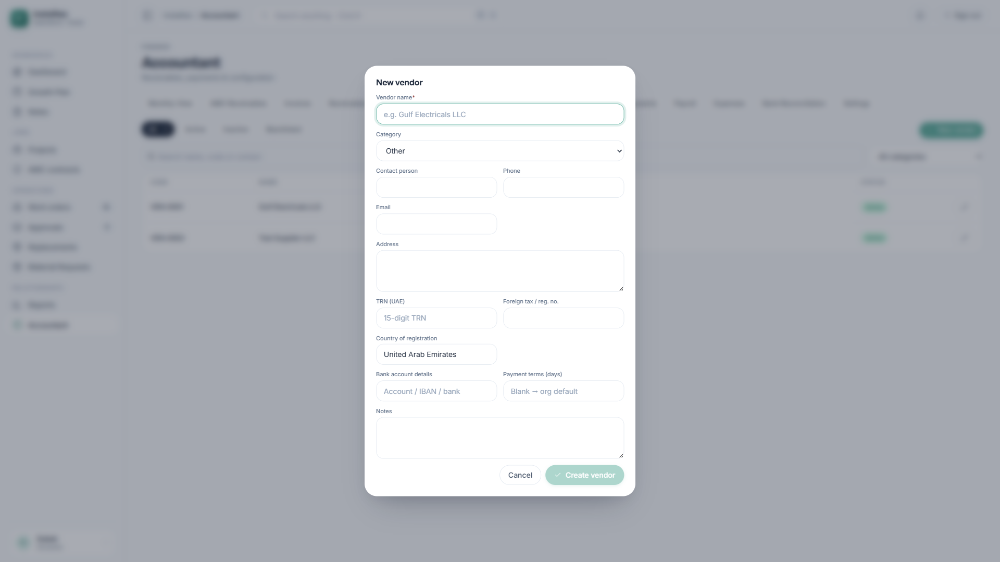

To add a vendor, provide:

- Vendor name.
- Country of registration (UAE or foreign).
- Tax Registration Number (TRN), for UAE vendors.
- Contact person, phone, and email.
- Address.
- Vendor category.
- Default payment terms.
- Banking details.

Vendor categories include **Materials Supplier**, **Service Provider**, **Subcontractor**, and **Other**.

## 6.3 Vendor Statuses

- **Active** — available for new transactions.
- **Inactive** — hidden from selection, but historical records are retained.
- **Blacklisted** — blocked from future transactions.

# 7. Purchase Orders

## 7.1 Purchase Orders Overview

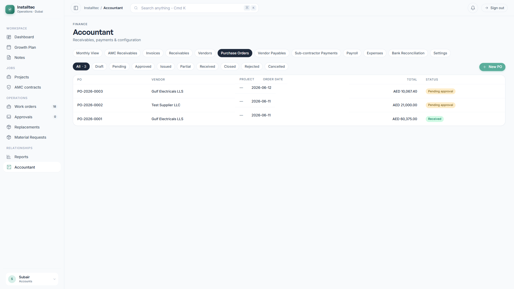

The **Purchase Orders** tab manages all procurement, from the initial draft through approval to receipt of goods.

## 7.2 Creating a Purchase Order

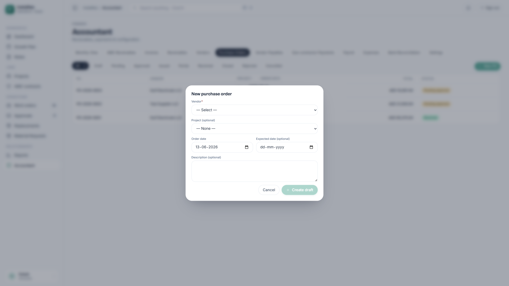

To create a purchase order, provide:

- Vendor selection.
- PO date and expected delivery date.
- A linked project (optional).
- Line items, each with a quantity and unit price.
- Delivery instructions and notes.

## 7.3 PO Approval Process

The system enforces automatic approval routing based on the total amount, as configured in **Settings** (see Section 3.5). A purchase order cannot be issued to a vendor until all required approvals have been obtained.

## 7.4 PO Statuses

- **Draft** — being prepared.
- **Pending Approval** — awaiting approvers.
- **Approved** — all approvals obtained.
- **Issued** — sent to the vendor.
- **Partially Received** — some items received.
- **Received** — all items received.
- **Closed** — the PO is complete.
- **Cancelled** — voided.

# 8. Vendor Payables

## 8.1 Vendor Payables Overview

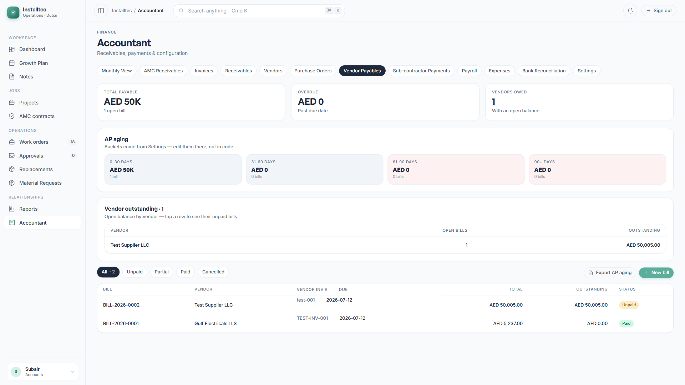

The **Vendor Payables** tab tracks all amounts owed to vendors, with an aging analysis that groups balances by how long they have been outstanding:

- 0 to 30 days
- 31 to 60 days
- 61 to 90 days
- Over 90 days (overdue)

## 8.2 Recording a Vendor Bill

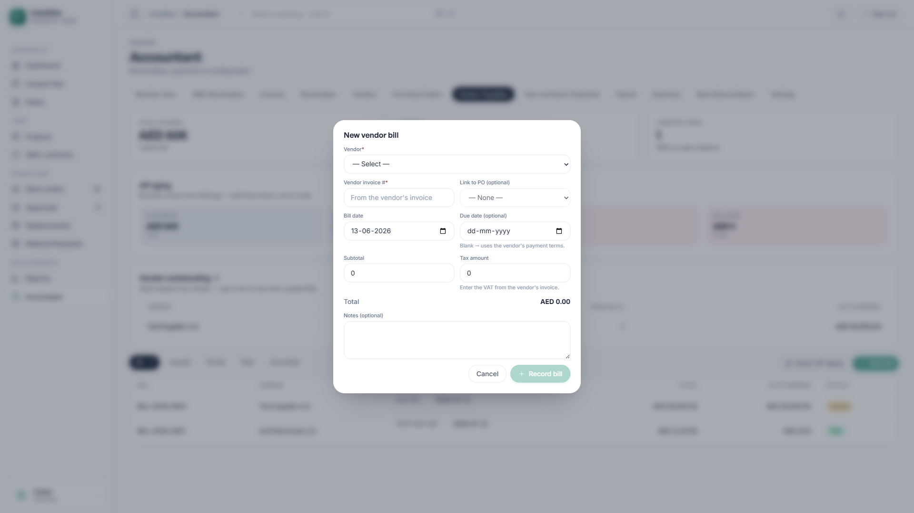

When you receive a vendor invoice, record it as a bill:

- Select the vendor and, optionally, link it to a PO.
- Enter the bill date and due date.
- Record the amount with its VAT breakdown.
- Add the vendor's reference number.
- Attach the scanned vendor invoice if you have it.

## 8.3 Recording Vendor Payments

- Open the vendor bill.
- Click **Record Payment**.
- Enter the payment date, amount, method, and reference.

Partial payments are supported.

# 9. Subcontractor Payments

## 9.1 Overview

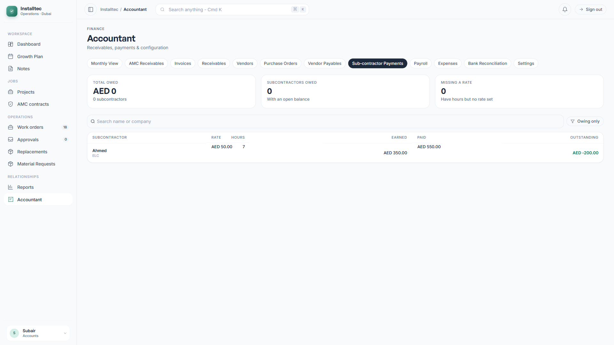

The **Subcontractor Payments** tab integrates with the time-tracking module to calculate the amounts owed to subcontractors, based on logged hours and the applicable rate cards.

Features include rate card management, payment tracking, an outstanding balance per subcontractor, and monthly settlement reports.

# 10. Payroll Management

## 10.1 Payroll Module Structure

The **Payroll** tab is organized into three sub-sections:

- **Employees** — master data.
- **Payroll Runs** — monthly processing.
- **End of Service** — gratuity calculations.

> **Important:** For confidentiality, the Operations Manager role cannot see the Payroll tab. Access is limited to the Accountant, Managing Director, and Administrator roles.

## 10.2 Employee Master

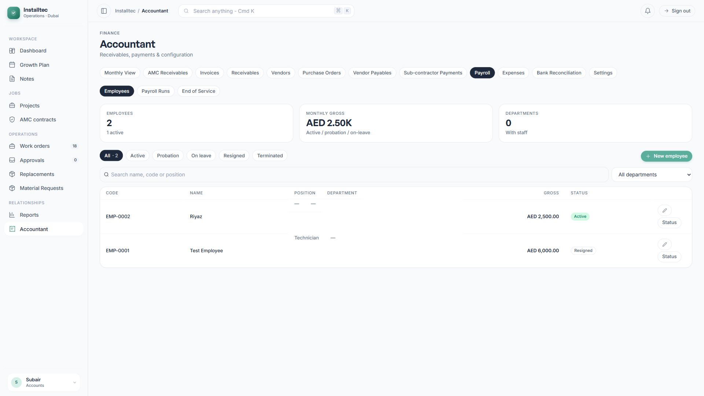

The **Employee Master** maintains a record for every employee, with their personal details, salary structure, and employment status. The Key Performance Indicators at the top show the total number of employees, the monthly gross salary, and a breakdown by department.

## 10.3 Adding an Employee

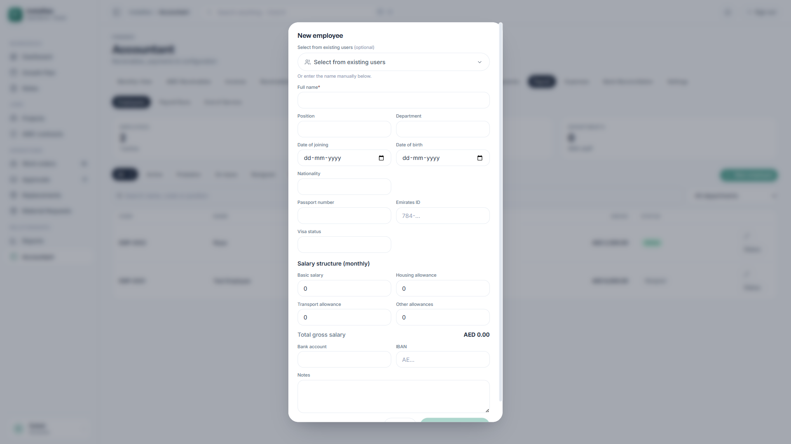

The form includes a **Select from existing users** dropdown that auto-populates the name from system users who already have login accounts. This eliminates duplicate data entry.

The form captures:

- Full name and position.
- Department and date of joining.
- Personal details: date of birth, nationality, passport, Emirates ID, and visa status.
- Salary structure: basic, housing, transport, and other allowances.
- Banking details: bank name and IBAN.
- Employment status.

## 10.4 UAE Salary Structure

UAE labor law requires the following salary breakdown:

- **Basic Salary** — the base pay component.
- **Housing Allowance** — a separate component.
- **Transport Allowance** — a separate component.
- **Other Allowances** — bonuses or special components.
- **Total Gross Salary** — the sum of all components.

This structure is required for WPS submission and for gratuity calculations.

## 10.5 Payroll Runs

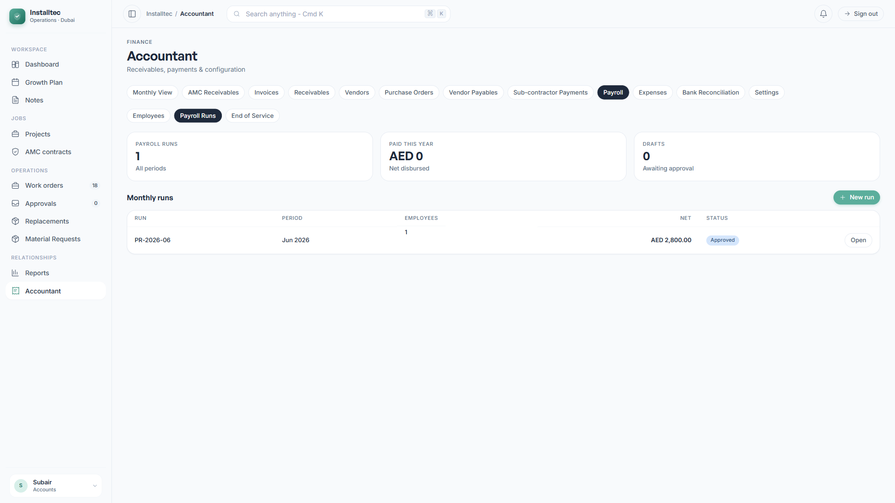

Each month produces one payroll run, which progresses through **Draft**, **Approved**, and **Paid** statuses. The system enforces a single active run per month.

## 10.6 Creating a Payroll Run

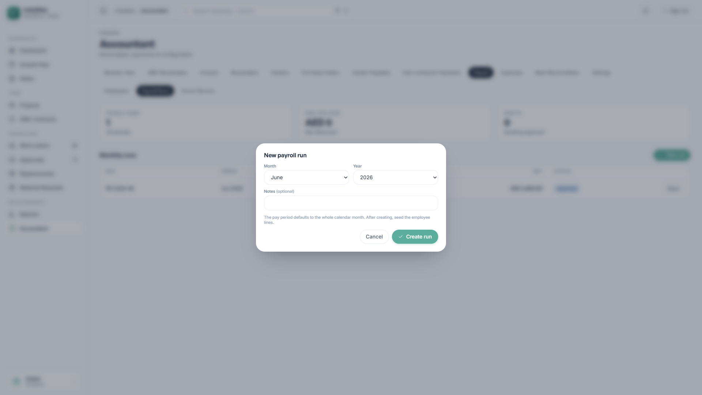

Select the year and month for the payroll period. The system validates that no active run already exists for that period.

## 10.7 Payroll Workflow

The complete monthly payroll workflow:

1. **Create the payroll run** for the period.
2. **Seed lines** — the system automatically creates one line per active employee, using the current salary breakdown as a snapshot.
3. **Adjust individual lines** — add overtime amounts, bonuses, or deductions for each employee.
4. **Approve the run** — the status changes to **Approved**.
5. **Generate the WPS file** — download the CSV for bank submission.
6. **Submit the WPS file** to the bank.
7. **Mark the run as paid** — the system creates salary payment records and locks the run.

Each line in the run is an immutable snapshot. This ensures that historical records remain unchanged even if employee salaries are updated later.

## 10.8 WPS File Generation

After payroll approval, the **Generate WPS File** function produces a CSV file in the UAE Wage Protection System SIF format, containing:

- Employee Detail Records (EDR) — one per employee.
- A Salary Control Record (SCR) — the control row.
- The Employer Establishment ID from **Settings**.
- The Employer Agent ID from **Settings**.
- A filename in the format `WPS_<run ID>_MMYYYY.csv`.

Upload this file to your bank's WPS portal for processing.

## 10.9 Payslip Generation

Click the document icon on any payroll line to open a printable payslip. Use your browser's print function to save it as a PDF or to print it directly.

## 10.10 End of Service Gratuity

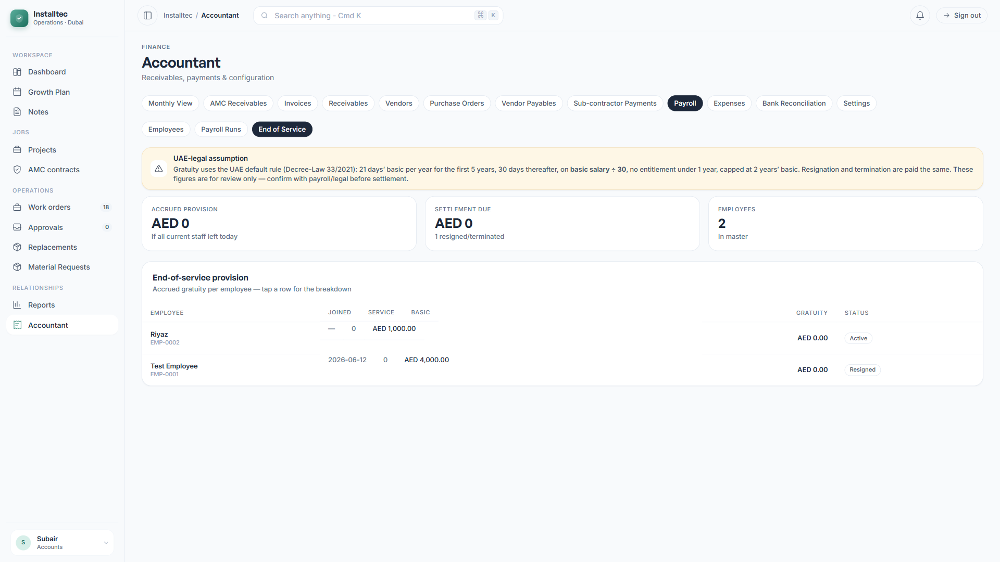

The **End of Service** section provides:

- A **Provision Report** — the accrued gratuity liability across all employees.
- A **Per-Employee Calculator** — a detailed gratuity calculation with an adjustable last working day.

The UAE gratuity rules implemented by the system are:

- 21 days of basic salary per year for the first 5 years of service.
- 30 days of basic salary per year for service beyond 5 years.
- No gratuity entitlement during the probation period (the first 6 months).
- A calculation base of basic salary divided by 30 (the per-day rate).
- A cap of a maximum of 2 years of basic salary.

## 10.11 UAE Payroll Compliance Notes

The system reflects several UAE-specific considerations:

- No statutory deductions are applied automatically.
- Overtime is entered as a manual amount, not as a multiplier.
- Gross salary is taken from the master record without mid-month proration.
- UAE labor law requires salary payment within the first 10 days of the following month.

# 11. Expense Management

## 11.1 Expenses Overview

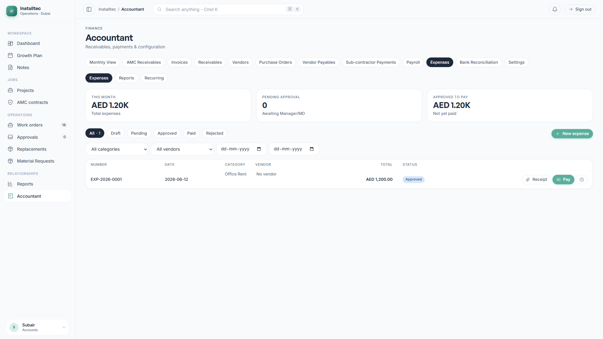

The **Expenses** tab tracks and manages all company operating expenses, with category-based organization, approval workflows, and recurring expense templates.

## 11.2 Creating an Expense

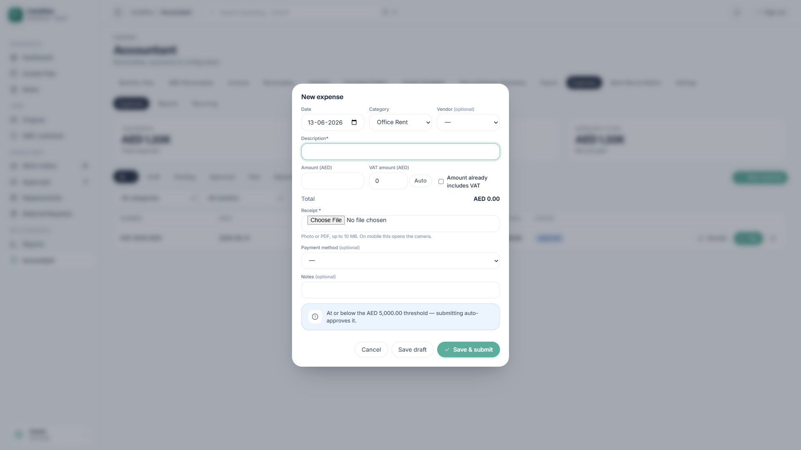

To create an expense, provide:

- The expense date.
- A category (from the configurable list).
- A vendor (optional — links to the vendor master).
- A description.
- The amount, with a VAT-inclusive flag.
- The VAT amount, if applicable.
- The payment method.
- A mandatory receipt attachment (photo or PDF).

Mobile users can capture receipts directly using the device camera, which ensures receipts are recorded immediately at the time of the expense.

## 11.3 Expense Approval Workflow

Expenses follow this workflow:

- **Draft** — initial creation, with a receipt.
- **Pending Approval** — submitted, because the amount is above the threshold.
- **Approved** — automatically approved if below the threshold, or approved by a Manager.
- **Paid** — the Accountant has marked the expense as paid.
- **Rejected** — rejected by an approver, with a reason.

The approval threshold (default **AED 5,000**) is configurable in **Settings**.

## 11.4 Expense Reports

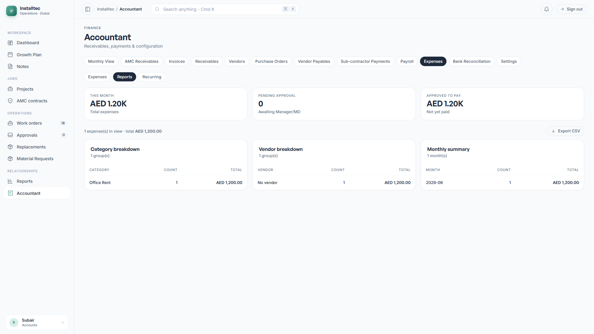

The available reports are:

- A monthly expense summary.
- A category breakdown.
- A vendor-wise expense report.

All reports support CSV export for further analysis.

## 11.5 Recurring Expenses

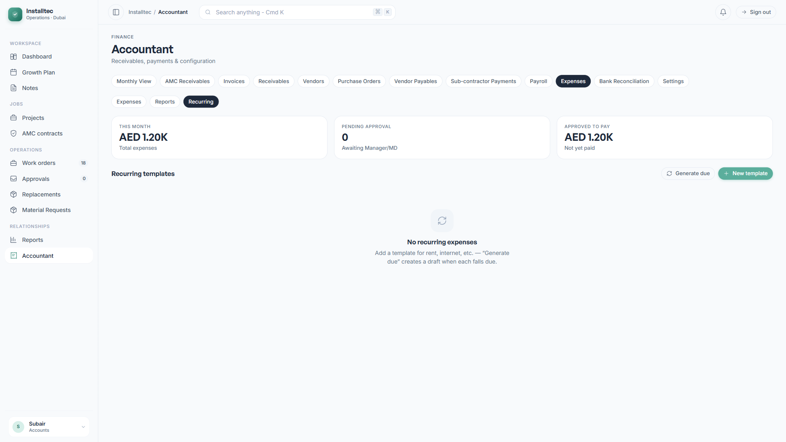

Set up templates for expenses that recur regularly, such as office rent, utilities, and subscriptions.

## 11.6 Creating Recurring Templates

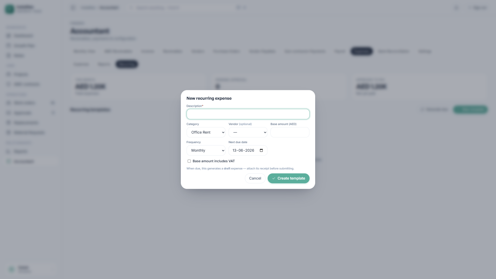

Each template includes:

- A category.
- A vendor (if applicable).
- A base amount.
- A frequency (**Monthly** or **Quarterly**).
- A next due date.
- An active status.

Click **Generate Due** to create draft expenses from all templates that are due. The Accountant then attaches a receipt to each one and submits it.

# 12. Bank Reconciliation

## 12.1 Bank Reconciliation Overview

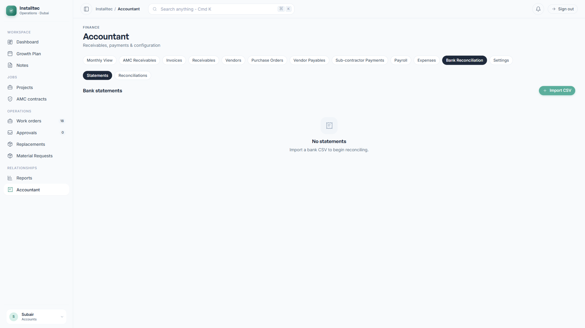

The **Bank Reconciliation** module ensures that the transactions recorded in the system match actual bank activity. This is performed monthly, as part of the financial close process.

## 12.2 Importing a Bank Statement

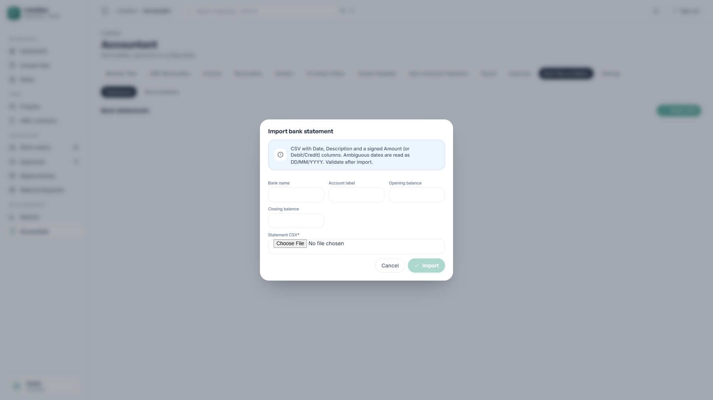

The system accepts CSV bank statements with flexible column detection:

- A **Date** column (the DD/MM/YYYY format is supported).
- A **Description** column.
- An **Amount** column (a single column with positive and negative values), or
- Separate **Debit** and **Credit** columns.

The original CSV file is stored in the system for audit purposes.

## 12.3 Auto-Matching Workflow

After import, the **Auto-Match** function compares each bank line against the recorded payments using:

- An exact amount match.
- The same direction (positive or negative).
- A date within 5 days.

Matched items are flagged with confirmation indicators. Unmatched items require manual review.

## 12.4 Manual Matching

For any unmatched bank line:

- Click the line.
- Select the matching recorded payment from the list.
- Add reference notes, or
- **Ignore** the line, with a reason.

## 12.5 Monthly Reconciliation

At month end:

- Create a new **Reconciliation** entry.
- Select the bank statement period.
- The bank balance prefills from the statement.
- Enter the book balance from the system.
- Review the calculated difference.
- Investigate any variance.
- Finalize the reconciliation.
- Generate a printable reconciliation report.

# 13. Monthly Workflow

A typical month for the Accountant follows the schedule below.

**Week 1**

- Generate monthly expenses from the recurring templates.
- Attach receipts to the expense drafts.
- Submit expenses for approval.

**Weeks 2 and 3**

- Issue invoices for completed milestones.
- Record vendor bills as they arrive.
- Process subcontractor payment calculations.
- Record incoming customer payments.
- Process expense approvals.

**Week 4 (Month End)**

- Create and process the monthly payroll run.
- Generate the WPS file and submit it to the bank.
- Mark payroll as paid after bank confirmation.
- Pay vendor bills that are falling due.
- Pay approved expenses.

**First Week of the Next Month**

- Download the bank statement.
- Import it into Bank Reconciliation.
- Perform auto-match and manual matching.
- Finalize the monthly reconciliation.
- Review the Monthly View dashboard.
- Generate and distribute the Status Report to the Managing Director.
- Generate the P&L and Cash Flow summaries.

# 14. UAE Compliance Features

The Accountant Module is designed for UAE business operations, with built-in compliance for the following.

**Value Added Tax (VAT)**

- A standard 5 percent rate applied to invoices and bills.
- The customer TRN and company TRN on all tax invoices.
- Per-line VAT-inclusive or VAT-exclusive handling.
- VAT amounts visible on every transaction.

**Wage Protection System (WPS)**

- The SIF file format for bank submission.
- Employer establishment ID configuration.
- Per-employee payment records for audit.
- Compliance with salary payment timing requirements.

**End of Service Gratuity**

- Automatic calculation in line with UAE labor law.
- 21 days per year for the first 5 years.
- 30 days per year beyond 5 years.
- Probation period handling.
- A maximum cap of 2 years of basic salary.

**Document Retention**

- A minimum 5-year retention period, per UAE FTA requirements.
- A configurable retention period in Settings.
- An audit trail for all financial transactions.
- Append-only history for all key records.

# 15. Security and Access Control

## 15.1 Role-Based Access

The system enforces strict role-based access control:

| Role       | Module Access                              |
|------------|--------------------------------------------|
| Accountant | Full access to all Accountant features.    |
| Manager    | View reports; approve invoices and POs.    |
| MD         | View all data; approve high-value items.   |
| Founder    | View all data; approve top-tier amounts.   |
| Admin      | System-wide configuration access.          |

The **Payroll** tab is restricted to the Accountant, MD, and Admin roles only, which keeps salary information confidential.

## 15.2 Audit Trail

Every financial transaction keeps an immutable audit log that captures:

- Who made the change.
- When the change occurred.
- What was modified.
- The previous and new values.

Audit logs cannot be edited or deleted by any user, including administrators.

## 15.3 Data Storage

- All documents are stored in private, secure buckets.
- Access is granted through time-limited signed URLs.
- Row-level security is applied to all database tables.
- Data is encrypted at rest and in transit.

# 16. Troubleshooting

## 16.1 Cannot Create an Invoice

- Confirm the customer exists in the system.
- Verify the customer has a TRN configured.
- Ensure the project is linked correctly.
- Check your permissions for invoice creation.

## 16.2 Purchase Order Approval Is Stuck

- Confirm the PO total falls within the approver's threshold.
- Verify that all prior approvers have approved.
- Check that the approver has logged in and reviewed pending items.

## 16.3 Payroll Run Cannot Be Approved

- Verify that all line items have values.
- Confirm at least one employee is in the run.
- Check that the approver has the appropriate permissions.

## 16.4 WPS File Generation Error

- Confirm the MOL Establishment ID is set in Settings.
- Confirm the Employer Agent ID is set in Settings.
- Verify the Bank Name is configured.
- Check that all employees have an IBAN populated.

## 16.5 Expense Cannot Be Saved

- A receipt attachment is mandatory.
- The file size limit is 10 MB per attachment.
- Accepted formats are JPEG, PNG, and PDF.

## 16.6 Bank Statement Import Failed

- The CSV must include Date, Description, and Amount columns.
- The date format should be DD/MM/YYYY.
- Amounts should be numeric, without currency symbols.
- The file size limit is 5 MB.

# 17. Glossary

| Term                | Definition                                        |
|---------------------|---------------------------------------------------|
| AED                 | UAE Dirham, the official currency.                |
| AP                  | Accounts Payable — money owed to vendors.         |
| AR                  | Accounts Receivable — money owed by customers.    |
| Audit Trail         | An immutable record of all changes.               |
| Bank Reconciliation | The process of matching bank activity to records. |
| CNL                 | Cash and Net Liability report.                    |
| Credit Note         | A document reducing a customer balance.           |
| EDR                 | Employee Detail Record in a WPS file.             |
| FTA                 | UAE Federal Tax Authority.                         |
| Gratuity            | End-of-service payment under UAE law.             |
| IBAN                | International Bank Account Number.                 |
| KPI                 | Key Performance Indicator.                         |
| MOL                 | UAE Ministry of Labour.                            |
| P&L                 | Profit and Loss statement.                         |
| Payable             | An amount owed to a vendor.                        |
| PO                  | Purchase Order.                                    |
| Receivable          | An amount owed by a customer.                      |
| Reconciliation      | The process of matching records.                  |
| RLS                 | Row Level Security.                                |
| SCR                 | Salary Control Record in a WPS file.              |
| SIF                 | Salary Information File for WPS.                   |
| TRN                 | Tax Registration Number for UAE VAT.              |
| VAT                 | Value Added Tax.                                   |
| WPS                 | Wage Protection System.                            |

# 18. Support

For technical issues with the system, contact **Sirah Digital** through your designated support channel.

For accounting and compliance questions, consult the relevant UAE authorities:

- UAE Federal Tax Authority — tax.gov.ae
- UAE Ministry of Human Resources and Emiratisation — mohre.gov.ae

```{=openxml}
<w:p><w:pPr><w:pBdr><w:top w:val="single" w:sz="6" w:space="6" w:color="CCCCCC"/></w:pBdr><w:spacing w:before="480"/><w:jc w:val="center"/></w:pPr><w:r><w:rPr><w:i/><w:color w:val="888888"/><w:sz w:val="18"/></w:rPr><w:t>Confidential and Proprietary. Prepared by Sirah Digital for Installtec. Version 1.0.</w:t></w:r></w:p>
```
